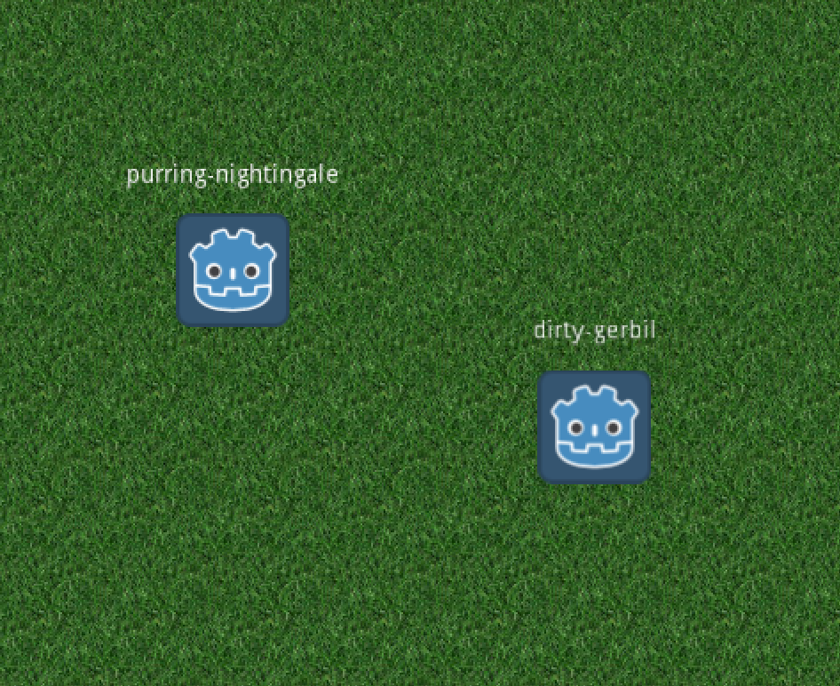

# water-cooler

An ongoing project used to teach myself multiplayer game development using web sockets while trying to create a fun virtual water cooler experience at the same time.

Can be played at http://projects.kokokoding.nl/water-cooler/



## Develop

### Client

#### Prequisites

Currently I have been using:

- Godot 3.2.3

But perhaps it also works on different versions of Godot.

### Server

#### Prequisites

- Node.js v15.4.0

#### Install dependencies

```sh
npm i
```

#### Start server

Develop server:

```sh
npm run dev
```

Production server:

```sh
npm start
```
